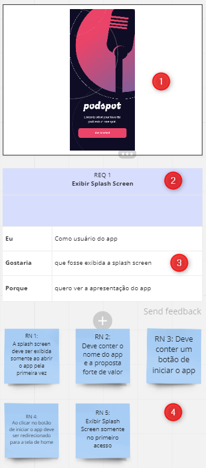

# Projeto Podcast APP

Este projeto foi criado com o propósito de praticar os **levantamentos de requisitos** de um projeto. Onde foi levado em consideração analisar um projeto do tipo Figma retirado do site UpsLabs onde vários designers tem a possibilidade de subir seus projetos. Com isso irei demonstrar a análise do projeto PodcastApp onde através do protótipo irei analisar os requisitos desejáveis para este projeto.

## Protótipo

- Protótipo do Figma [PodcastApp](https://www.uplabs.com/posts/podcast-app-27e7dba2-b5d6-40f8-be0f-52d6710b9af7)

## Analise do Projeto

A imagem abaixo irá indicar como foi feita a análise desse projeto, onde foi utilizado o **MIRO** para fazer a análise de forma visual.

1. Indicação da imagem a ser analisada
2. Indicação de qual requerimento iremos analisar, indicando o número e nome
3. Descrição em alto nível da funcionalidade, indicando o usuário que irá utilizar, a funcionalidade desejada e o porque da existencia dessa funcionalidade. 
4. Listagem das regras de negócio a serem implementadas.

 

### Referência da análise

- REQ 1 - Exibir Splash Screen

- REQ 2 - Criar padrão de Header

- REQ 3 - TOP 10 Podcast

- REQ 4 - Exibir as categorias de Podcast

- REQ 5 - Exibir as recomendações

- REQ 6 - Tela inicial do podcast

- REQ 7 - Exibir a lista de todos os episódios

- REQ 8 - Exibir do player de execução do podcast