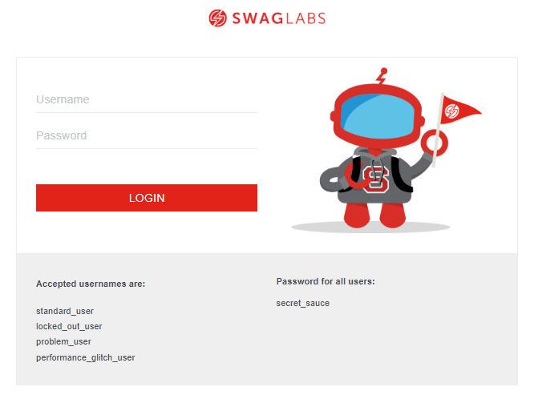

# Portfólio

Este projeto tem como finalidade mostrar o meu trabalho com análise de requisitos e plano de testes.

Neste repositório você irá encontrar a analise de dois (2) projetos, sendo:

- Análise de requisitos de um protótipo figma
- Plano de Teste de um site

## Portfólio Análise de Requisitos

- Protótipo do Figma [PodcastApp](https://www.uplabs.com/posts/podcast-app-27e7dba2-b5d6-40f8-be0f-52d6710b9af7)

## Portfólio Plano de Teste

- Site utilizado para elaboração do plano [Saucedemo](https://www.saucedemo.com/)

