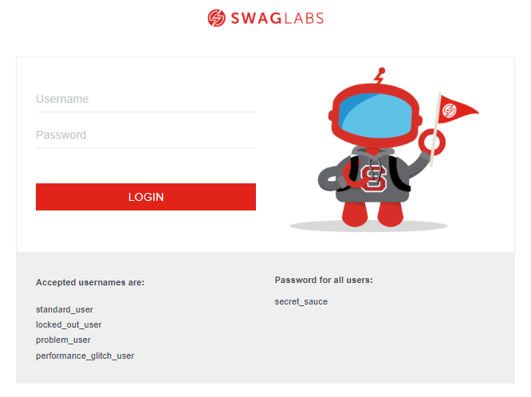
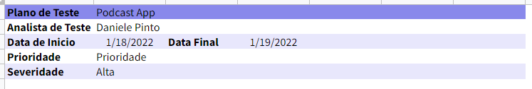
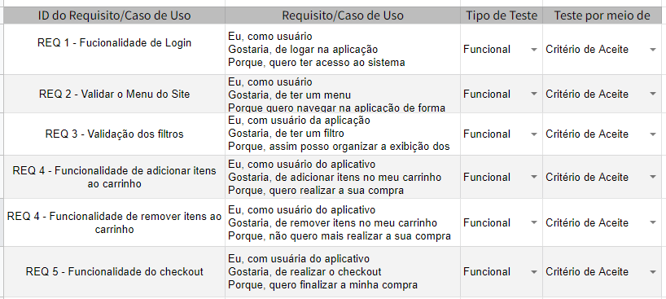
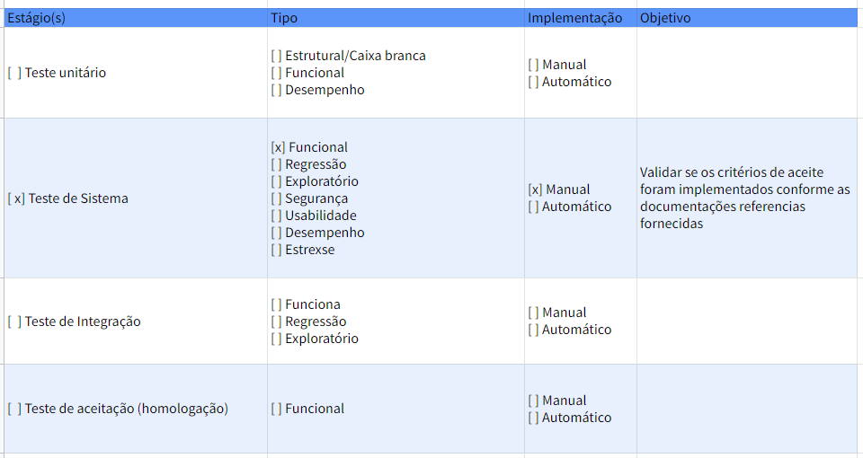
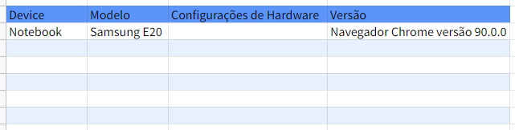
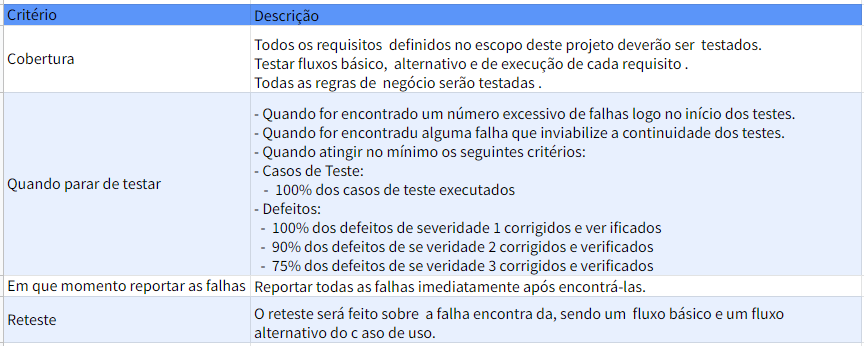
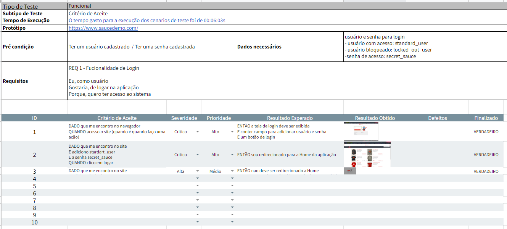

# Projeto Saucedemo

Este projeto foi criado com o propósito de praticar a criação e execução do **Plano de teste** de um projeto. Onde foi levado em consideração analisar um site já existente, realizar o levantando os seus requisitos, criação de suites e casos de teste para execução. 

## Ferramentas

- Site utilizado para elaboração do plano [Saucedemo](https://www.saucedemo.com/)

- Excel para crianção do Plano de teste

## Plano de teste

### Apresentação do Plano   

Na aba de introdução da planilha, irá conter todas as informações do projeto:

Na aba de Escopo de teste são apresentados os requisitos de teste:

Na aba Estratégias de Teste é apresentado a estratégia selecionada para tal plano:

Na aba Ambiente de teste é apresentado os detalhes de ontem o app foi testado:

Na aba de Critérios de aceite é apresentado os detalhes dos critérios utilizados no teste:

Na aba Suite_(nome do requisito) são apresentados todas as informações necessárias para a execução dos testes viculados à suite. Entre eles:

- Tipo de teste: escolhido na aba de estratégia de teste.
- O subtipo do teste: apresentado na ava de "Critérios de Aceite".
- Tempo de execução: o tempo gasto para a execução daquele teste.
- Protótipo: link de visualizaçao do protótipo
- Pré condição: o que é necessário para executar o testes.
- Dados necessários: dados obrigatórios para executar o teste.
- Requisitos: Requisito selecionado para aquele teste.
- Critério de aceite: criação do critério de aceite para realização do teste com gherkin.
- Severidade: qual o nível de severidade do critéro de aceite.
- Prioridade: qual o nível de prioridade de desenvolvimento daquele critério de aceite.
- Resultado esperado: Qual seria o resultado após a execução do teste.
- Resultado obtido: Qual foi o resultado obtido após a execução do teste, com foto ou videos.
- Defeitos: Se houve, apresentar o defeito obtido no teste com foto ou vídeo.
- Finalizado: Marcação de controle para quando o teste for finalizado.

